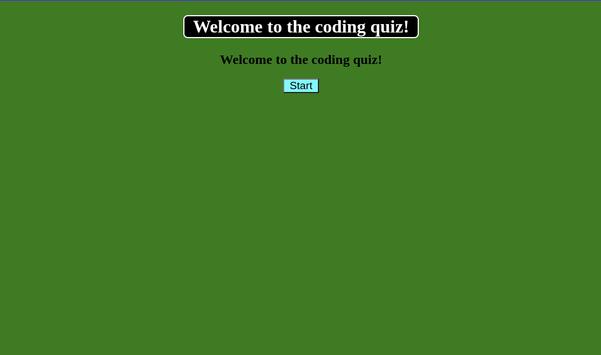
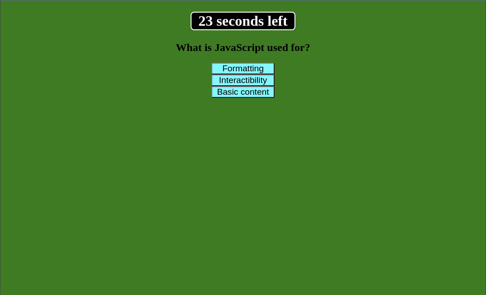
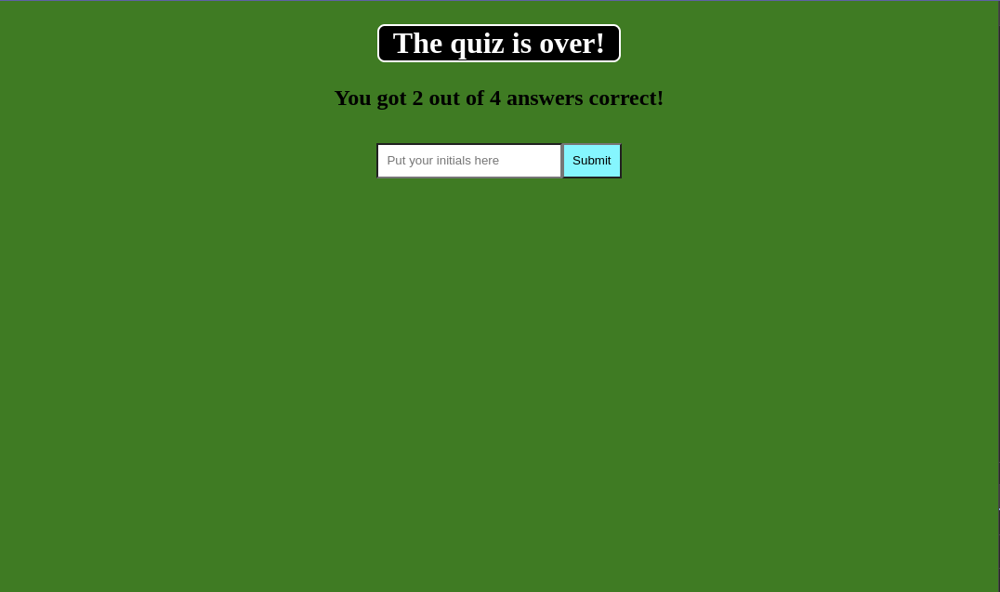
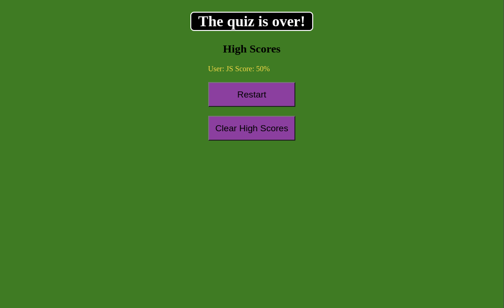

# coding-quiz-evank
A short coding quiz.
Deployed page can be found at https://33649ek.github.io/coding-quiz-evank/.

Note that some styling has changed for the application as compared to what is found in the following screenshots.

## Installation

N/A

## Usage

When the webpage is opened, clicking the start button will start the timer and quiz. If a correct question is clicked, the page will move to the next question. If an incorrect question is selected, the timer will decrement by 3 seconds and move to the next question. When all questions have been answered, the user may save their score and initials.

## Credits

Code from the following sources was all modified significantly for use in this application.

https://www.freecodecamp.org/news/event-delegation-javascript/

Class repository

Jay Mascerenas (Pre-class office hours)

## License

MIT License